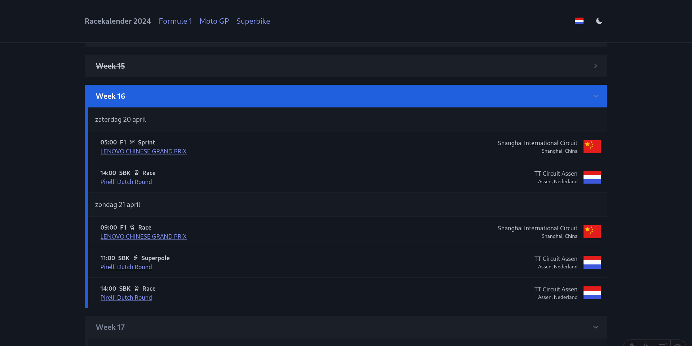
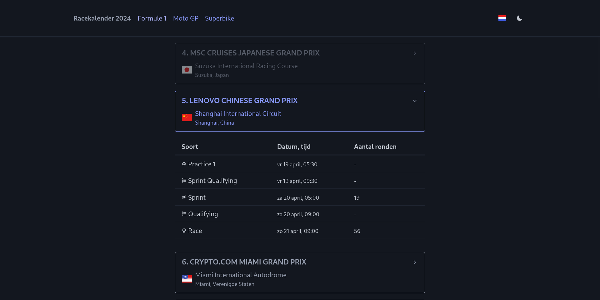

# Race calendar

## TODO 2026

1. Wait for https://www.formula1.com/en/racing/2026/spain to get updated -> Circuit information missing
2. Wait for motogp data to become available, as of 2026-01-29 only the first race (Thailand) is available

Counting down the days until the next race!

![Pico css 2.1](https://img.shields.io/badge/Pico%20css%202.1-black.svg?style=for-the-badge&logo=data:image/svg+xml;base64,PD94bWwgdmVyc2lvbj0iMS4wIiBlbmNvZGluZz0iVVRGLTgiPz4KPHN2ZyB2aWV3Qm94PSIwIDAgMTAyNCAxMDI0IiB4bWxucz0iaHR0cDovL3d3dy53My5vcmcvMjAwMC9zdmciPgo8cGF0aCBkPSJtNzc3LjM5IDYwOS4xOGMtNS40MjcgMi4wMzktOS43MTYgNi4yMjktMTEuODAzIDExLjUzMWwtODAuMjg3IDIwMy45NWMtNi43NTUgMTcuMTU5LTMxLjYwNCAxNy4xNi0zOC4zNTkgMGwtODAuMjg3LTIwMy45NWMtMi4wODctNS4zMDItNi4zNzYtOS40OTItMTEuODAzLTExLjUzMWwtMjA4Ljc1LTc4LjQ0MmMtMTcuNTY0LTYuNTk5LTE3LjU2NC0zMC44NzcgMC0zNy40NzZsMjA4Ljc1LTc4LjQ0MmM1LjQyNy0yLjAzOSA5LjcxNi02LjIyOSAxMS44MDMtMTEuNTMxbDgwLjI4Ny0yMDMuOTVjNi43NTUtMTcuMTU5IDMxLjYwNC0xNy4xNTkgMzguMzU5IDBsODAuMjg3IDIwMy45NWMyLjA4NyA1LjMwMiA2LjM3NiA5LjQ5MiAxMS44MDMgMTEuNTMxbDIwOC43NSA3OC40NDJjMTcuNTY2IDYuNTk5IDE3LjU2NiAzMC44NzcgMCAzNy40Nzd6IiBmaWxsPSIjRkY5NTAwIiB4bWxucz0iaHR0cDovL3d3dy53My5vcmcvMjAwMC9zdmciLz4KPGcgZmlsbD0iI0ZGQkYwMCIgeG1sbnM9Imh0dHA6Ly93d3cudzMub3JnLzIwMDAvc3ZnIj4KPHBhdGggZD0ibTE5Mi4xMiAzNDIuODJjLTYuNzU2IDE3LjE2LTMxLjYwNCAxNy4xNi0zOC4zNTkgMGwtMjguOTE1LTczLjQ0OWMtMi4wODctNS4zMDItNi4zNzYtOS40OTItMTEuODAzLTExLjUzMmwtNzUuMTc4LTI4LjI1Yy0xNy41NjMtNi41OTktMTcuNTYzLTMwLjg3NyAwLTM3LjQ3N2w3NS4xNzgtMjguMjQ5YzUuNDI3LTIuMDQgOS43MTYtNi4yMyAxMS44MDMtMTEuNTMybDI4LjkxNS03My40NWM2Ljc1NS0xNy4xNTkgMzEuNjAzLTE3LjE1OSAzOC4zNTkgMWUtNGwyOC45MTQgNzMuNDVjMi4wODcgNS4zMDIgNi4zNzYgOS40OTIgMTEuODAzIDExLjUzMmw3NS4xNzggMjguMjQ5YzE3LjU2MyA2LjYgMTcuNTYzIDMwLjg3OCAwIDM3LjQ3N2wtNzUuMTc4IDI4LjI1Yy01LjQyNyAyLjA0LTkuNzE2IDYuMjMtMTEuODAzIDExLjUzMnoiLz4KPHBhdGggZD0ibTM1Ni4xMyA4NjAuMTRjLTUuNDI3IDIuMDM5LTkuNzE1IDYuMjI5LTExLjgwMyAxMS41MzFsLTI4LjkxNCA3My40NWMtNi43NTUgMTcuMTU5LTMxLjYwNCAxNy4xNTktMzguMzU5IDBsLTI4LjkxNS03My40NWMtMi4wODctNS4zMDItNi4zNzYtOS40OTItMTEuODAyLTExLjUzMWwtNzUuMTc5LTI4LjI1Yy0xNy41NjMtNi42LTE3LjU2My0zMC44NzcgMC0zNy40NzdsNzUuMTc5LTI4LjI1YzUuNDI2LTIuMDM5IDkuNzE1LTYuMjI5IDExLjgwMi0xMS41MzFsMjguOTE1LTczLjQ1YzYuNzU1LTE3LjE2IDMxLjYwNC0xNy4xNiAzOC4zNTkgMGwyOC45MTQgNzMuNDVjMi4wODggNS4zMDIgNi4zNzYgOS40OTIgMTEuODAzIDExLjUzMWw3NS4xNzggMjguMjVjMTcuNTYzIDYuNiAxNy41NjMgMzAuODc3IDAgMzcuNDc3eiIvPgo8L2c+Cjwvc3ZnPgo=)

**2026 race calendar for:**

- Formula 1
- MotoGP

**2024/2025 race calendar for:**

- Formula 1
- MotoGP
- Superbike

**Tech info:**

- All pages are statically generated (["SSG"](https://docs.astro.build/en/guides/routing/#static-ssg-mode)) into HTML files
- Event date/times and distances are localized with [Intl.DateTimeFormat](https://developer.mozilla.org/en-US/docs/Web/JavaScript/Reference/Global_Objects/Intl/DateTimeFormat) in the browser

## Screenshots

**Home page**

Overview of every (sprint)race and superpoles for all categories (F1, MotoGP, Superbike.)

**Detail page**

Lists, per category, every practice / qualification / sprint / race time and lap count if applicable.

